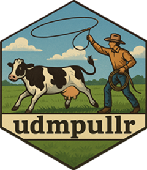

<!-- README.md is generated from README.Rmd. Please edit that file -->

# udmpullr 

<!-- badges: start -->

[](https://lifecycle.r-lib.org/articles/stages.html#experimental)
<!-- badges: end -->

The goal of udmpullr is to provide convenient functions to access data
from the [Understanding Data and Markets (UDM)
API](https://commoditymarkets.com/).

## Installation

You can install the development version of udmpullr from
[GitHub](https://github.com/) with:

``` r
# install.packages("pak")
pak::pak("tmhanon/udmpullr")
```

or

``` r
# install.package("devtools")
devtools::install_github("tmhanon/udmpullr")
```

## Basic Workflow

### Setting Credentials

In order to access the UDM API you must have an account registered with
UDM. Visit <https://commoditymarkets.com/> for more information. Once
your account is registered, you will use your username (typically an
email address) and password to authorize access to the UDM API. There
are multiple options to set your credentials to allow `udmpullr` to pull
from the UDM API on your behalf:

1.  Use `set_udm_credentials()` to input your credentials (username and
    password). R will save your credentials and `udmpullr` will be able
    to access them within the same session. However, next time you open
    R you will have to re-enter your credentials.
    `set_udm_credentials()` takes two arguments, `UDM_API_USERNAME` and
    `UDM_API_PASSWORD`. Alternatively, you can leave either or both
    arguments blank and R will prompt you to enter your credentials in
    popup windows (using the
    [`askpass`](https://github.com/r-lib/askpass) package).

``` r
set_udm_credentials(UDM_API_USERNAME = my_UDM_username,
                    UDM_API_PASSWORD = my_UDM_password)

# set_udm_credentials()
# Running without arguments will prompt you to enter your credentials in a popup window.
```

2.  If you use the UDM API regularly, a better option is to use
    environmental variables to permanently set your credentials. Open or
    create a `.Renviron` file using `usethis::edit_r_environ()` and add
    `UDM_API_USERNAME="<your UDM email/username>"` and
    `UDM_API_PASSWORD="<your UDM password>"` on separate lines. Save the
    file (ensuring there is a blank line at the end of the file) and
    restart R. Your ‘UDM’ API credentials will now be available to
    `udmpullr()` across R sessions.

After you have set your UDM API credentials using either of these
options, they can be retrieved using the functions `get_udm_username`
and `get_udm_password`. The main `udmpullr()` function uses these
retrieval functions as default arguments so access to the UDM API is
authorized correctly.

### Accessing Data

The primary function to access data from the UDM API is `udmpullr()`.
Suppose you want to access the daily dairy product prices from the CME
spot market. Within the UDM API, these data are contained within a table
named “UDM_Report_CME_Dairy_Spot_Market_Overview_Daily”. This can be
passed to `udmpullr()` as the first argument, `table_name`:

``` r
udmpullr(table_name = "UDM_Report_CME_Dairy_Spot_Market_Overview_Daily")
#> # A tibble: 6,698 × 50
#>    Report_Period        LastModified            Active CME_Nonfat_Dry_Milk_Gra…¹
#>    <chr>                <chr>                   <lgl>                      <dbl>
#>  1 1998-09-01T00:00:00Z 2019-03-05T21:06:46.54Z TRUE                        1.1 
#>  2 1998-09-02T00:00:00Z 2019-03-05T21:06:46.54Z TRUE                        1.12
#>  3 1998-09-03T00:00:00Z 2019-03-05T21:06:46.54Z TRUE                        1.13
#>  4 1998-09-09T00:00:00Z 2019-03-05T21:06:46.54Z TRUE                       NA   
#>  5 1998-09-10T00:00:00Z 2019-03-05T21:06:46.54Z TRUE                       NA   
#>  6 1998-09-11T00:00:00Z 2019-03-05T21:06:46.54Z TRUE                        1.16
#>  7 1998-09-16T00:00:00Z 2019-03-05T21:06:46.54Z TRUE                        1.16
#>  8 1998-09-17T00:00:00Z 2019-03-05T21:06:46.54Z TRUE                        1.16
#>  9 1998-09-18T00:00:00Z 2019-03-05T21:06:46.54Z TRUE                        1.16
#> 10 1998-09-21T00:00:00Z 2019-03-05T21:06:46.54Z TRUE                        1.16
#> # ℹ 6,688 more rows
#> # ℹ abbreviated name: ¹​CME_Nonfat_Dry_Milk_Grade_A_Spot_Price
#> # ℹ 46 more variables: UDM_CME_Nonfat_Dry_Milk_Grade_A_Spot_Quantity <int>,
#> #   UDM_CME_Nonfat_Dry_Milk_Grade_A_Spot_Transaction_Count <int>,
#> #   CME_Butter_Grade_AA_Spot_Price <dbl>,
#> #   UDM_CME_Butter_Grade_AA_Spot_Quantity <int>,
#> #   UDM_CME_Butter_Grade_AA_Spot_Transaction_Count <int>, …
```

As shown, `udmpullr()` will return the entire table, with data back to
1998. In most cases this is likely overkill, so `udmpullr()` also allows
you to specify a start date and end date using the `start_date` and
`end_date` variables. This filters the data before it is pulled, which
should also speed up the response time. The following example will pull
data for the last two weeks (note that using `Sys.Date()` as the
`end_date` argument is not strictly necessary).

``` r
udmpullr(table_name = "UDM_Report_CME_Dairy_Spot_Market_Overview_Daily",
         start_date = Sys.Date() - lubridate::days(14),
         end_date = Sys.Date())
#> # A tibble: 9 × 50
#>   Report_Period        LastModified             Active CME_Nonfat_Dry_Milk_Gra…¹
#>   <chr>                <chr>                    <lgl>                      <dbl>
#> 1 2025-06-10T00:00:00Z 2025-06-10T11:46:07.82Z  TRUE                        1.26
#> 2 2025-06-11T00:00:00Z 2025-06-11T11:46:07.813Z TRUE                        1.26
#> 3 2025-06-12T00:00:00Z 2025-06-12T11:46:07.717Z TRUE                        1.26
#> 4 2025-06-13T00:00:00Z 2025-06-13T11:46:09.49Z  TRUE                        1.27
#> 5 2025-06-16T00:00:00Z 2025-06-16T11:46:13.15Z  TRUE                        1.27
#> 6 2025-06-17T00:00:00Z 2025-06-17T11:46:08.14Z  TRUE                        1.26
#> 7 2025-06-18T00:00:00Z 2025-06-18T11:46:09.497Z TRUE                        1.28
#> 8 2025-06-20T00:00:00Z 2025-06-20T11:46:14.287Z TRUE                        1.26
#> 9 2025-06-23T00:00:00Z 2025-06-23T11:46:07.55Z  TRUE                        1.26
#> # ℹ abbreviated name: ¹​CME_Nonfat_Dry_Milk_Grade_A_Spot_Price
#> # ℹ 46 more variables: UDM_CME_Nonfat_Dry_Milk_Grade_A_Spot_Quantity <int>,
#> #   UDM_CME_Nonfat_Dry_Milk_Grade_A_Spot_Transaction_Count <int>,
#> #   CME_Butter_Grade_AA_Spot_Price <dbl>,
#> #   UDM_CME_Butter_Grade_AA_Spot_Quantity <int>,
#> #   UDM_CME_Butter_Grade_AA_Spot_Transaction_Count <int>,
#> #   CME_Cheese_40_Lbs_Blocks_Spot_Price <dbl>, …
```

The UDM API has a limit of 10,000 rows of data in any single response.
This is an issue for certain tables, such as the daily futures panel,
which have far more than 10,000 rows of data. Therefore, it is necessary
to filter the data to some extent before pulling from the UDM API. The
`start_date` and `end_date` arguments are one option for doing so, but
`udmpullr()` also allows specific products to be specified (for tables
where that is applicable). For example, the daily futures panel includes
a variable called `Product_Name`, and `udmpullr()` allows a specific
product to be specified via the `product_name` argument:

``` r
udmpullr("UDM_Report_Futures_Prices_Daily_Panel",
         product_name = "CME Class III Milk Futures",
         start_date = Sys.Date() - lubridate::days(7))
#> # A tibble: 115 × 12
#>    Product_Name  Contract_Month Report_Period Nearby_Index Open_Price High_Price
#>    <chr>         <chr>          <chr>                <int>      <dbl>      <dbl>
#>  1 CME Class II… 2026-04-01T00… 2025-06-23T0…           11       18.0       18.0
#>  2 CME Class II… 2026-03-01T00… 2025-06-23T0…           10       18.0       18.1
#>  3 CME Class II… 2026-01-01T00… 2025-06-23T0…            8       18.1       18.1
#>  4 CME Class II… 2027-03-01T00… 2025-06-23T0…           22       17         17  
#>  5 CME Class II… 2026-12-01T00… 2025-06-23T0…           19       18.4       18.4
#>  6 CME Class II… 2026-02-01T00… 2025-06-23T0…            9       18         18.0
#>  7 CME Class II… 2026-09-01T00… 2025-06-23T0…           16       18.4       18.4
#>  8 CME Class II… 2025-12-01T00… 2025-06-23T0…            7       18.4       18.4
#>  9 CME Class II… 2026-10-01T00… 2025-06-23T0…           17       18.4       18.5
#> 10 CME Class II… 2026-05-01T00… 2025-06-23T0…           12       18.1       18.1
#> # ℹ 105 more rows
#> # ℹ 6 more variables: Low_Price <dbl>, Close_Price <dbl>, Volume <int>,
#> #   Open_Interest <int>, LastModified <chr>, Active <int>
```

The `product_name` argument can also easily be iterated over using the
\``purrr::map()` function, allowing for several products to be pulled
simultaneously.

``` r
list("CME Class III Milk Futures",
     "CME Class IV Milk Futures",
     "CME Cash-Settled Butter Futures",
     "CME Non-Fat Dry Milk Futures",
     "CME Dry Whey Futures",
     "CME Cash-Settled Cheese Futures") %>%
  purrr::map(\(x) udmpullr("UDM_Report_Futures_Prices_Daily_Panel",
                           product_name = x,
                           start_date = Sys.Date() - lubridate::days(7),
                           end_date = Sys.Date())) %>%
  dplyr::bind_rows()
#> # A tibble: 676 × 12
#>    Product_Name  Contract_Month Report_Period Nearby_Index Open_Price High_Price
#>    <chr>         <chr>          <chr>                <int>      <dbl>      <dbl>
#>  1 CME Class II… 2026-04-01T00… 2025-06-23T0…           11       18.0       18.0
#>  2 CME Class II… 2026-03-01T00… 2025-06-23T0…           10       18.0       18.1
#>  3 CME Class II… 2026-01-01T00… 2025-06-23T0…            8       18.1       18.1
#>  4 CME Class II… 2027-03-01T00… 2025-06-23T0…           22       17         17  
#>  5 CME Class II… 2026-12-01T00… 2025-06-23T0…           19       18.4       18.4
#>  6 CME Class II… 2026-02-01T00… 2025-06-23T0…            9       18         18.0
#>  7 CME Class II… 2026-09-01T00… 2025-06-23T0…           16       18.4       18.4
#>  8 CME Class II… 2025-12-01T00… 2025-06-23T0…            7       18.4       18.4
#>  9 CME Class II… 2026-10-01T00… 2025-06-23T0…           17       18.4       18.5
#> 10 CME Class II… 2026-05-01T00… 2025-06-23T0…           12       18.1       18.1
#> # ℹ 666 more rows
#> # ℹ 6 more variables: Low_Price <dbl>, Close_Price <dbl>, Volume <int>,
#> #   Open_Interest <int>, LastModified <chr>, Active <int>
```
